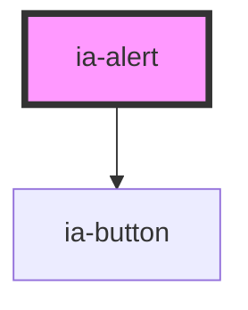

# lila-alert

<!-- Auto Generated Below -->

## Properties

| Property      | Attribute     | Description | Type                                          | Default     |
| ------------- | ------------- | ----------- | --------------------------------------------- | ----------- |
| `closeable`   | `closeable`   | 是否显示关闭按钮    | `boolean`                                     | `false`     |
| `content`     | `content`     | 提示文字内容      | `string`                                      | `''`        |
| `description` | `description` | 当前提示的描述     | `string`                                      | `''`        |
| `type`        | `type`        | 提示类型        | `"error" \| "info" \| "success" \| "warning"` | `'success'` |

## Dependencies

### Depends on

- [ia-button](../button)

### Graph

----------------------------------------------

*Built with love❤️!*
