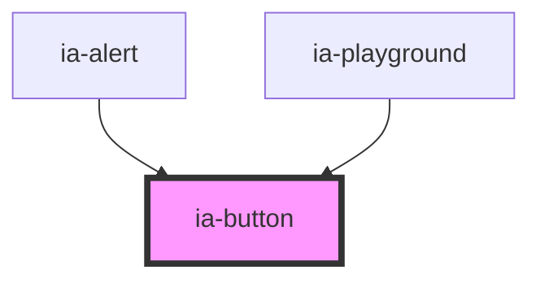

# lila-button

<!-- Auto Generated Below -->

## Properties

| Property   | Attribute  | Description | Type                                                                            | Default     |
| ---------- | ---------- | ----------- | ------------------------------------------------------------------------------- | ----------- |
| `color`    | `color`    |             | `string`                                                                        | `undefined` |
| `disabled` | `disabled` | 是否被禁用       | `boolean`                                                                       | `false`     |
| `loading`  | `loading`  | 是否正在加载中     | `boolean`                                                                       | `false`     |
| `round`    | `round`    | 是否设置圆角      | `boolean`                                                                       | `false`     |
| `size`     | `size`     |             | `"medium" \| "mini" \| "small"`                                                 | `'medium'`  |
| `type`     | `type`     | 按钮类型        | `"error" \| "info" \| "plain" \| "primary" \| "success" \| "text" \| "warning"` | `'plain'`   |

## Slots

| Slot        | Description  |
| ----------- | ------------ |
| `"spinner"` | loading加载指示器 |

## Dependencies

### Used by

 - [ia-alert](../alert)
 - [ia-playground](../playground)

### Graph

----------------------------------------------

*Built with love❤️!*
