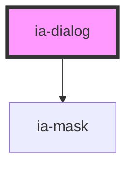

# ia-dialog

<!-- Auto Generated Below -->

## Properties

| Property               | Attribute | Description        | Type      | Default     |
| ---------------------- | --------- | ------------------ | --------- | ----------- |
| `atRoot`               | `at-root` | 是否将modal元素移动至body下 | `boolean` | `false`     |
| `tilte`                | `tilte`   | title              | `string`  | `''`        |
| `visible` _(required)_ | `visible` |                    | `boolean` | `undefined` |

## Events

| Event   | Description | Type               |
| ------- | ----------- | ------------------ |
| `close` |             | `CustomEvent<any>` |

## Dependencies

### Depends on

- [ia-mask](../mask)

### Graph

----------------------------------------------

*Built with love❤️!*
