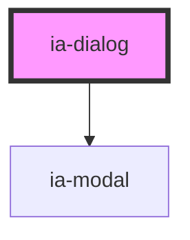

# ia-dialog

<!-- Auto Generated Below -->

## Properties

| Property | Attribute | Description        | Type      | Default |
| -------- | --------- | ------------------ | --------- | ------- |
| `atRoot` | `at-root` | 是否将modal元素移动至body下 | `boolean` | `false` |
| `tilte`  | `tilte`   |                    | `string`  | `''`    |

## Dependencies

### Depends on

- [ia-modal](../modal)

### Graph

----------------------------------------------

*Built with love❤️!*
