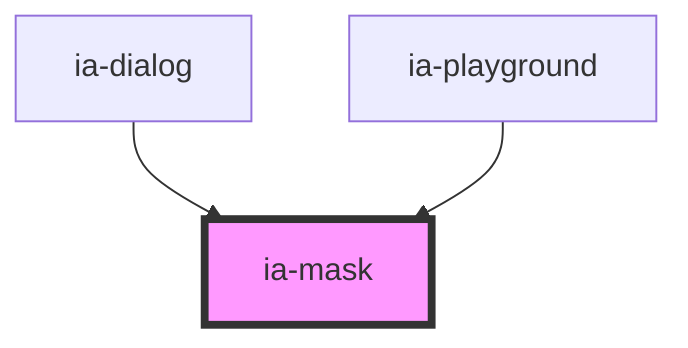

# ia-modal

<!-- Auto Generated Below -->

## Properties

| Property               | Attribute         | Description | Type                                                         | Default      |
| ---------------------- | ----------------- | ----------- | ------------------------------------------------------------ | ------------ |
| `modal`                | `modal`           |             | `boolean`                                                    | `true`       |
| `transitionName`       | `transition-name` |             | `"from-bottom" \| "from-left" \| "from-right" \| "from-top"` | `'from-top'` |
| `visible` _(required)_ | `visible`         |             | `boolean`                                                    | `undefined`  |

## Events

| Event   | Description | Type                |
| ------- | ----------- | ------------------- |
| `close` |             | `CustomEvent<void>` |

## Dependencies

### Used by

 - [ia-dialog](../dialog)
 - [ia-playground](../playground)

### Graph

----------------------------------------------

*Built with love❤️!*
