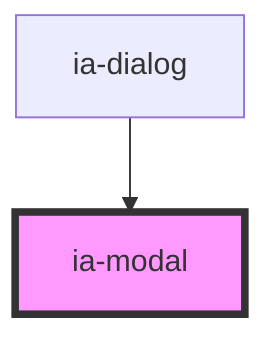

# ia-modal

<!-- Auto Generated Below -->

## Properties

| Property | Attribute | Description        | Type      | Default |
| -------- | --------- | ------------------ | --------- | ------- |
| `atRoot` | `at-root` | 是否将modal元素移动至body下 | `boolean` | `false` |

## Dependencies

### Used by

 - [ia-dialog](../dialog)

### Graph

----------------------------------------------

*Built with love❤️!*
