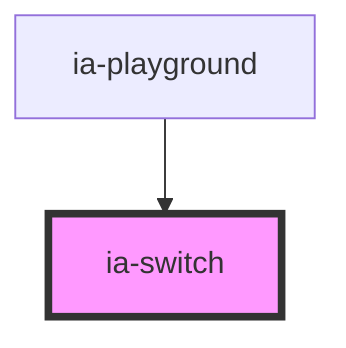

# ia-switch

<!-- Auto Generated Below -->

## Properties

| Property   | Attribute  | Description | Type      | Default |
| ---------- | ---------- | ----------- | --------- | ------- |
| `checked`  | `checked`  | 是否开启        | `boolean` | `false` |
| `disabled` | `disabled` | 是否被禁用       | `boolean` | `false` |

## Events

| Event      | Description | Type                      |
| ---------- | ----------- | ------------------------- |
| `iaChange` | 改变事件        | `CustomEvent<IaCheckbox>` |

## Dependencies

### Used by

 - [ia-playground](../playground)

### Graph

----------------------------------------------

*Built with love❤️!*
